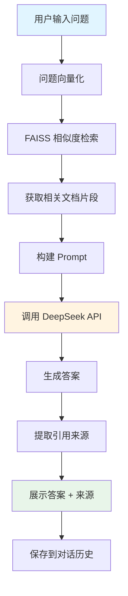
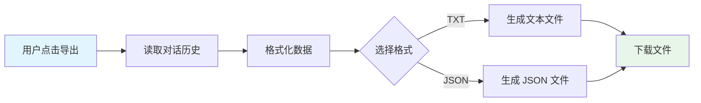

# 数据流程图 - DocuMind

## 文档处理流程


## 问答交互流程



## 对话历史导出流程



## 核心改造点

### 1. API 替换
- **原始**: OpenAI GPT-3.5 API
- **改造**: DeepSeek Chat API
- **影响**: 仅需修改 API 调用部分，其他逻辑不变

### 2. 引用来源
- **新增**: 在返回答案时附带文档来源信息
- **实现**: 从检索结果中提取 metadata

### 3. 对话历史
- **新增**: Session State 存储对话记录
- **实现**: 导出为 TXT/JSON 格式

```