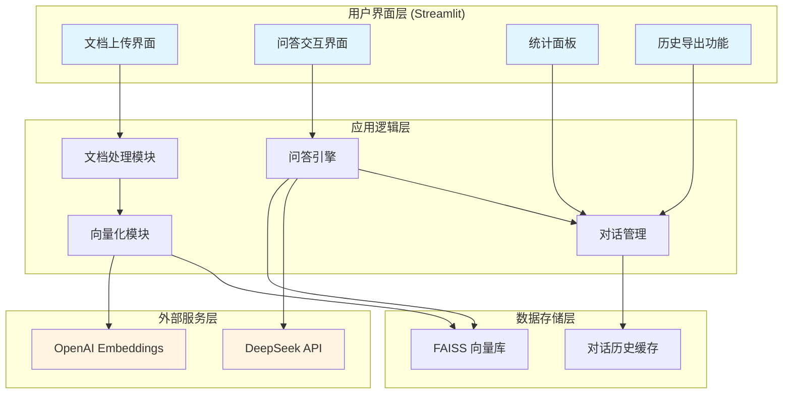

# 系统架构图 - DocuMind

## 整体架构

## 技术栈说明

### 前端层
- **Streamlit**: Web UI 框架
- **HTML Templates**: 自定义样式

### 后端层
- **LangChain**: LLM 应用框架
- **PyPDF2**: PDF 文本提取
- **Python**: 核心逻辑

### 存储层
- **FAISS**: 向量数据库（本地）
- **Session State**: 会话状态管理

### 外部服务
- **DeepSeek API**: 大语言模型
- **OpenAI Embeddings**: 文本向量化