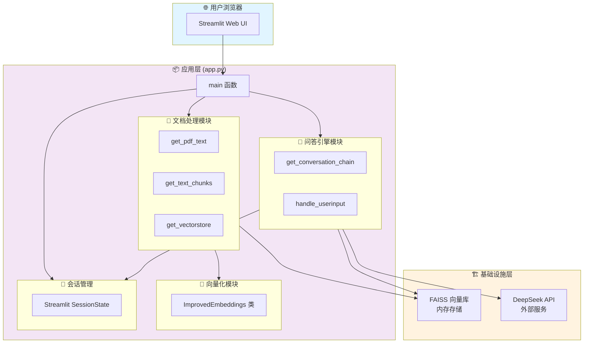
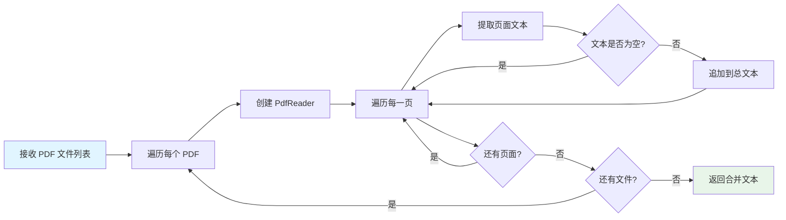
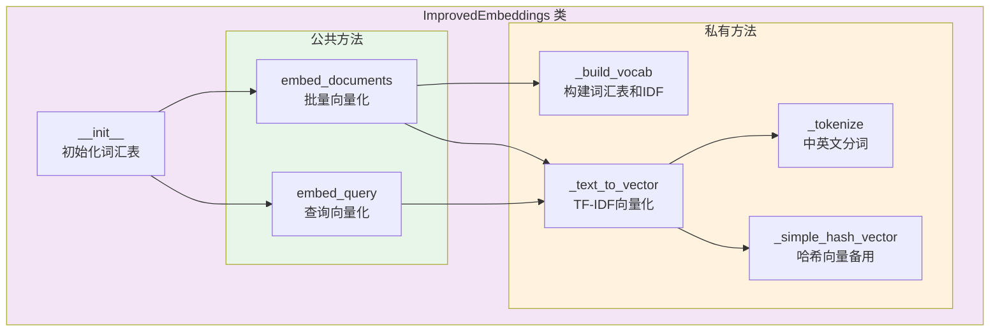
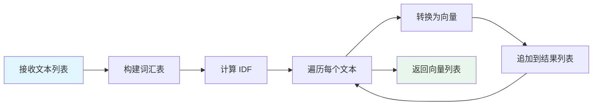
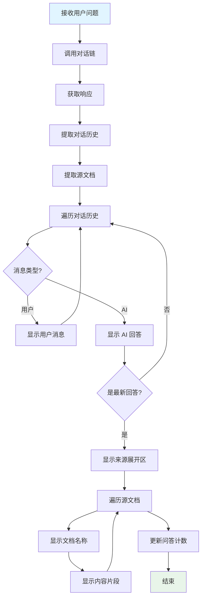
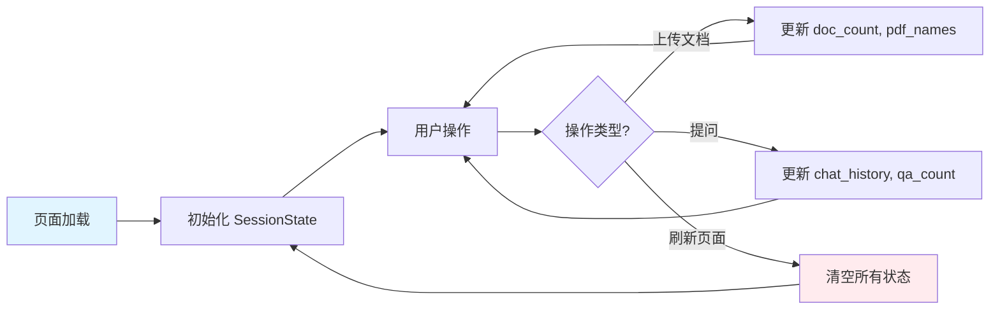
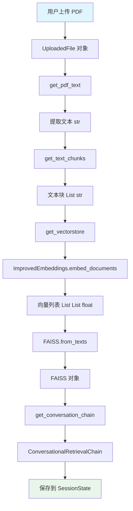
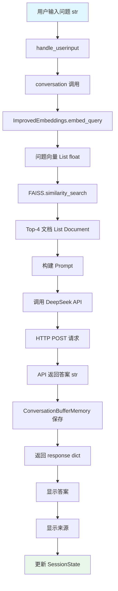
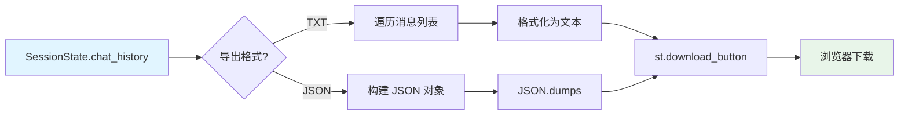
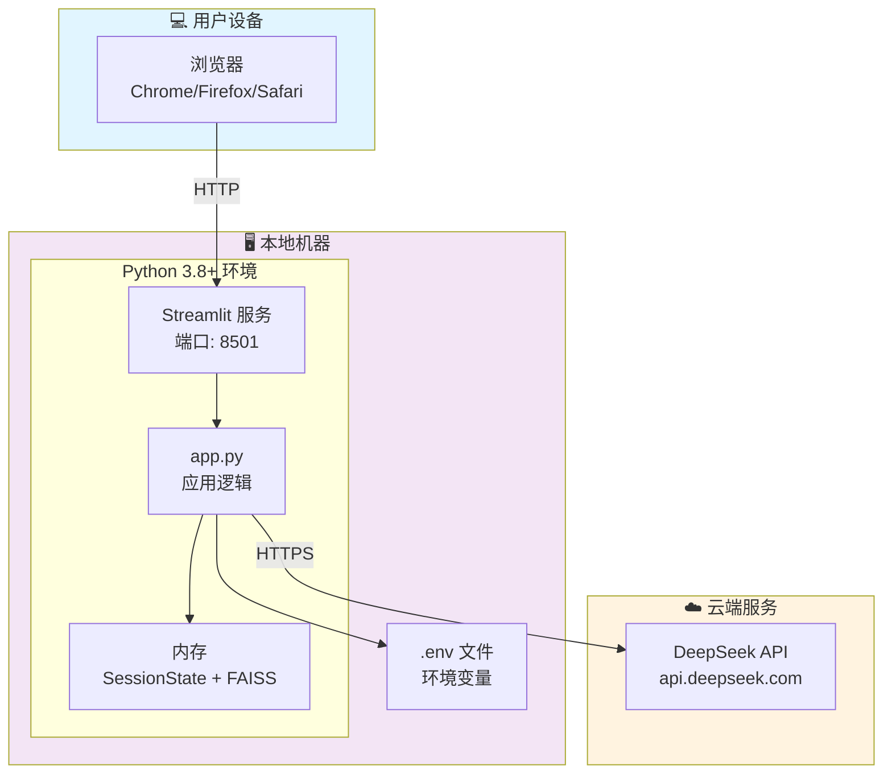

# Architecture Spec - DocuMind 系统架构

**版本**: v1.0
 **日期**: 2026-06-14
 **状态**: ✅ 已实现
 **作者**: 郑龙腾 (2025303007)
 **课程**: CS599 企业级应用软件设计与开发
 **指导教师**: 戚欣

------

## 📋 目录

1. [架构概述](https://monica.im/home/chat/Claude 4.5 Sonnet/claude_4_5_sonnet?convId=conv%3A4f344b14-ee3a-44be-a15f-cb9a6c86f86f#1-架构概述)
2. [系统架构](https://monica.im/home/chat/Claude 4.5 Sonnet/claude_4_5_sonnet?convId=conv%3A4f344b14-ee3a-44be-a15f-cb9a6c86f86f#2-系统架构)
3. [核心组件设计](https://monica.im/home/chat/Claude 4.5 Sonnet/claude_4_5_sonnet?convId=conv%3A4f344b14-ee3a-44be-a15f-cb9a6c86f86f#3-核心组件设计)
4. [数据流设计](https://monica.im/home/chat/Claude 4.5 Sonnet/claude_4_5_sonnet?convId=conv%3A4f344b14-ee3a-44be-a15f-cb9a6c86f86f#4-数据流设计)
5. [技术选型](https://monica.im/home/chat/Claude 4.5 Sonnet/claude_4_5_sonnet?convId=conv%3A4f344b14-ee3a-44be-a15f-cb9a6c86f86f#5-技术选型)
6. [部署架构](https://monica.im/home/chat/Claude 4.5 Sonnet/claude_4_5_sonnet?convId=conv%3A4f344b14-ee3a-44be-a15f-cb9a6c86f86f#6-部署架构)
7. [安全设计](https://monica.im/home/chat/Claude 4.5 Sonnet/claude_4_5_sonnet?convId=conv%3A4f344b14-ee3a-44be-a15f-cb9a6c86f86f#7-安全设计)
8. [限制与权衡](https://monica.im/home/chat/Claude 4.5 Sonnet/claude_4_5_sonnet?convId=conv%3A4f344b14-ee3a-44be-a15f-cb9a6c86f86f#8-限制与权衡)

------

## 1. 架构概述

### 1.1 架构风格

**实际架构**: 单体应用 + 函数式编程

```
复制架构特征:
  应用类型: 单体应用（Monolithic）
  编程范式: 函数式编程（Functional Programming）
  文件结构: 单文件应用（app.py）
  前后端: 一体化（Streamlit）
  数据存储: 内存存储（无持久化）
  部署方式: 本地运行
```

### 1.2 设计原则

| 原则         | 说明                 | 实现方式               |
| ------------ | -------------------- | ---------------------- |
| **简单性**   | 保持代码简洁易懂     | 单文件应用，函数式设计 |
| **最小改动** | 基于原始项目最小改动 | 仅替换 API 和新增功能  |
| **可维护性** | 易于理解和修改       | 清晰的函数命名和注释   |
| **可扩展性** | 预留扩展空间         | 模块化函数设计         |

### 1.3 架构约束

```
复制技术约束:
  - Python 版本: ≥ 3.8
  - 运行环境: 单机部署
  - 数据存储: 仅内存（SessionState）
  - 并发模型: 单线程同步执行

业务约束:
  - 用户模型: 单用户会话
  - 数据隔离: 无（同一浏览器会话共享）
  - 会话持久化: 不支持（刷新页面丢失）
```

------

## 2. 系统架构

### 2.1 整体架构图
    



### 2.2 模块职责

| 模块             | 职责                       | 主要函数/类                                        |
| ---------------- | -------------------------- | -------------------------------------------------- |
| **文档处理模块** | PDF 解析、文本分块、向量化 | `get_pdf_text` `get_text_chunks` `get_vectorstore` |
| **问答引擎模块** | 对话链创建、问答处理       | `get_conversation_chain` `handle_userinput`        |
| **向量化模块**   | 文本向量化（TF-IDF）       | `ImprovedEmbeddings`                               |
| **会话管理模块** | 状态管理、历史记录         | Streamlit SessionState                             |
| **基础设施层**   | 向量检索、LLM 调用         | FAISS DeepSeek API                                 |

------

## 3. 核心组件设计

### 3.1 文档处理模块

#### 3.1.1 PDF 文本提取

**函数**: `get_pdf_text(pdf_docs)`

**职责**: 从 PDF 文件中提取文本内容

**流程图**:    



**实现代码**:

```
复制def get_pdf_text(pdf_docs):
    """从 PDF 文件中提取文本"""
    text = ""
    for pdf in pdf_docs:
        try:
            pdf_reader = PdfReader(pdf)
            for page in pdf_reader.pages:
                page_text = page.extract_text()
                if page_text:
                    text += page_text + "\n"
        except Exception as e:
            st.error(f"❌ 读取 {pdf.name} 失败: {str(e)}")
    return text
```

**输入输出**:

```
复制输入:
  类型: List[UploadedFile]
  示例: [file1.pdf, file2.pdf]

输出:
  类型: str
  格式: "页面1内容\n页面2内容\n..."
  
异常处理:
  - 捕获 Exception
  - 显示错误提示
  - 继续处理其他文件
```

#### 3.1.2 文本分块

**函数**: `get_text_chunks(text)`

**职责**: 将长文本分割成固定大小的文本块

**流程图**:


**实现代码**:

```
复制def get_text_chunks(text):
    """将文本分割成小块"""
    text_splitter = CharacterTextSplitter(
        separator="\n",
        chunk_size=500,
        chunk_overlap=100,
        length_function=len
    )
    chunks = text_splitter.split_text(text)
    return chunks
```

**配置参数**:

```
复制参数说明:
  separator: "\n"
    说明: 优先按换行符分割
    原因: 保持段落完整性
  
  chunk_size: 500
    说明: 每块最多 500 字符
    原因: 平衡上下文长度和检索精度
  
  chunk_overlap: 100
    说明: 相邻块重叠 100 字符
    原因: 避免语义被截断
  
  length_function: len
    说明: 使用字符数计算长度
    原因: 简单直接
```

#### 3.1.3 向量存储创建

**函数**: `get_vectorstore(text_chunks, pdf_names)`

**职责**: 创建 FAISS 向量存储并保存元数据

**流程图**:


**实现代码**:

```
复制def get_vectorstore(text_chunks, pdf_names=None):
    """创建向量存储，保存文档来源信息"""
    embeddings = ImprovedEmbeddings()
    
    # 为每个文本块添加元数据
    metadatas = []
    for i, chunk in enumerate(text_chunks):
        doc_index = i % len(pdf_names) if pdf_names and len(pdf_names) > 0 else 0
        metadata = {
            'source': pdf_names[doc_index] if pdf_names else f'文档_{i // 10 + 1}',
            'chunk_id': i
        }
        metadatas.append(metadata)
    
    vectorstore = FAISS.from_texts(
        texts=text_chunks,
        embedding=embeddings,
        metadatas=metadatas
    )
    return vectorstore
```

**元数据结构**:

```
复制metadata:
  source: str
    说明: 文档文件名
    示例: "paper1.pdf"
    用途: 显示答案来源
  
  chunk_id: int
    说明: 文本块编号
    示例: 0, 1, 2, ...
    用途: 调试和追踪
```

------

### 3.2 向量化模块

#### 3.2.1 ImprovedEmbeddings 类设计

**类名**: `ImprovedEmbeddings`

**职责**: 使用 TF-IDF 算法将文本转换为向量

**类结构**:



**属性**:

```
复制vocab: dict
  说明: 词汇表，单词到索引的映射
  示例: {"文档": 0, "问答": 1, "system": 2}
  初始化: 空字典 {}

idf: dict
  说明: 逆文档频率，单词到 IDF 值的映射
  示例: {"文档": 1.23, "问答": 2.45}
  计算公式: log(文档总数 / (包含该词的文档数 + 1))
```

#### 3.2.2 核心方法实现

**方法 1: embed_documents**

```
复制def embed_documents(self, texts: List[str]) -> List[List[float]]:
    """将文本转换为向量"""
    # 构建词汇表
    self._build_vocab(texts)
    
    embeddings = []
    for text in texts:
        vector = self._text_to_vector(text)
        embeddings.append(vector)
    return embeddings
```

**流程**:



**方法 2: _build_vocab**

```
复制def _build_vocab(self, texts: List[str]):
    """构建词汇表和 IDF"""
    all_words = set()
    for text in texts:
        words = self._tokenize(text)
        all_words.update(words)
    
    # 构建词汇表索引
    self.vocab = {word: idx for idx, word in enumerate(sorted(all_words))}
    
    # 计算 IDF
    doc_count = len(texts)
    word_doc_count = {}
    for text in texts:
        words = set(self._tokenize(text))
        for word in words:
            word_doc_count[word] = word_doc_count.get(word, 0) + 1
    
    for word, count in word_doc_count.items():
        self.idf[word] = np.log(doc_count / (count + 1))
```

**方法 3: _tokenize**

```
复制def _tokenize(self, text: str) -> List[str]:
    """简单的分词"""
    text = text.lower()
    # 支持中文和英文
    import re
    # 提取中文字符和英文单词
    chinese = re.findall(r'[\u4e00-\u9fff]+', text)
    english = re.findall(r'[a-z]+', text)
    
    # 中文按字符分，英文按单词分
    tokens = []
    for word in chinese:
        tokens.extend(list(word))
    tokens.extend(english)
    
    return tokens
```

**分词策略**:

```
复制中文:
  方式: 按字符分割
  正则: [\u4e00-\u9fff]+
  示例: "文档问答" → ["文", "档", "问", "答"]

英文:
  方式: 按单词分割
  正则: [a-z]+
  示例: "document qa" → ["document", "qa"]

预处理:
  - 转小写: text.lower()
  - 去除标点: 仅保留中英文
```

**方法 4: _text_to_vector**

```
复制def _text_to_vector(self, text: str, dim: int = 512) -> List[float]:
    """将文本转换为向量（使用 TF-IDF）"""
    if not self.vocab:
        # 如果没有词汇表，使用简单哈希
        return self._simple_hash_vector(text, dim)
    
    # 使用 TF-IDF
    words = self._tokenize(text)
    word_count = {}
    for word in words:
        word_count[word] = word_count.get(word, 0) + 1
    
    # 创建稀疏向量
    vector = np.zeros(min(dim, len(self.vocab)))
    for word, count in word_count.items():
        if word in self.vocab:
            idx = self.vocab[word] % dim
            tf = count / len(words) if words else 0
            idf = self.idf.get(word, 1)
            vector[idx] += tf * idf
    
    # 归一化
    norm = np.linalg.norm(vector)
    if norm > 0:
        vector = vector / norm
    
    return vector.tolist()
```

**向量维度映射**:

```
复制维度: 512
映射方式: idx = vocab[word] % 512
说明: 使用取模将词汇表索引映射到固定维度
优点: 固定维度，节省内存
缺点: 可能产生哈希冲突
```

------

### 3.3 问答引擎模块

#### 3.3.1 对话链创建

**函数**: `get_conversation_chain(vectorstore)`

**职责**: 创建 LangChain 对话链

**流程图**:


**实现代码**:

```
复制def get_conversation_chain(vectorstore):
    """创建对话链"""
    llm = ChatOpenAI(
        model_name="deepseek-chat",
        openai_api_key=os.getenv("OPENAI_API_KEY"),
        openai_api_base=os.getenv("OPENAI_API_BASE"),
        temperature=0.7
    )
    
    memory = ConversationBufferMemory(
        memory_key='chat_history',
        return_messages=True,
        output_key='answer'
    )
    
    conversation_chain = ConversationalRetrievalChain.from_llm(
        llm=llm,
        retriever=vectorstore.as_retriever(search_kwargs={"k": 4}),
        memory=memory,
        return_source_documents=True
    )
    return conversation_chain
```

**组件配置**:

```
复制ChatOpenAI:
  model_name: "deepseek-chat"
  openai_api_key: 从环境变量读取
  openai_api_base: "https://api.deepseek.com/v1"
  temperature: 0.7
    说明: 控制生成随机性
    范围: 0.0 (确定) ~ 1.0 (随机)

ConversationBufferMemory:
  memory_key: "chat_history"
  return_messages: True
    说明: 返回 Message 对象而非字符串
  output_key: "answer"
    说明: 从返回结果中提取答案的键

ConversationalRetrievalChain:
  llm: ChatOpenAI 实例
  retriever: vectorstore.as_retriever()
    search_kwargs:
      k: 4
        说明: 检索最相关的 4 个文档
  memory: ConversationBufferMemory 实例
  return_source_documents: True
    说明: 返回引用的源文档
```

#### 3.3.2 用户输入处理

**函数**: `handle_userinput(user_question)`

**职责**: 处理用户问题并显示答案和来源

**流程图**:



**实现代码**:

```
复制def handle_userinput(user_question):
    """处理用户输入并显示答案和来源"""
    try:
        # 调用对话链
        response = st.session_state.conversation({'question': user_question})
        
        # 更新对话历史
        st.session_state.chat_history = response['chat_history']
        
        # 保存源文档
        source_documents = response.get('source_documents', [])
        
        # 显示对话历史
        for i, message in enumerate(st.session_state.chat_history):
            if i % 2 == 0:
                # 用户消息
                st.write(user_template.replace(
                    "{{MSG}}", message.content), unsafe_allow_html=True)
            else:
                # AI 回答
                st.write(bot_template.replace(
                    "{{MSG}}", message.content), unsafe_allow_html=True)
                
                # 显示答案来源（只在最新的回答下显示）
                if i == len(st.session_state.chat_history) - 1 and source_documents:
                    with st.expander("📚 查看答案来源", expanded=False):
                        for idx, doc in enumerate(source_documents):
                            st.markdown(f"**来源 {idx + 1}:**")
                            
                            # 显示文档信息
                            source = doc.metadata.get('source', '未知文档')
                            st.markdown(f"- 📄 文档: `{source}`")
                            
                            # 显示内容片段
                            content = doc.page_content[:300]
                            st.markdown(f"- 📝 内容片段:")
                            st.text_area(
                                f"片段 {idx + 1}",
                                content,
                                height=100,
                                key=f"source_{idx}_{st.session_state.qa_count}",
                                disabled=True
                            )
                            
                            if idx < len(source_documents) - 1:
                                st.markdown("---")
        
        # 更新问答计数
        if 'qa_count' in st.session_state:
            st.session_state.qa_count += 1
    
    except Exception as e:
        st.error(f"❌ 处理问题时出错：{str(e)}")
        st.info("💡 请检查：\n1. 文档是否已处理\n2. API Key 是否正确\n3. 网络连接是否正常")
```

**响应结构**:

```
复制response:
  answer: str
    说明: AI 生成的答案
  
  chat_history: List[Message]
    说明: 完整对话历史
    结构:
      - Message(content=str, type="human"|"ai")
  
  source_documents: List[Document]
    说明: 引用的源文档（最多 4 个）
    结构:
      - Document:
          page_content: str
          metadata:
            source: str
            chunk_id: int
```

------

### 3.4 会话管理模块

#### 3.4.1 SessionState 设计

**管理方式**: Streamlit SessionState

**状态变量**:

```
复制conversation:
  类型: ConversationalRetrievalChain | None
  初始值: None
  说明: 对话链实例
  更新时机: 处理文档后

chat_history:
  类型: List[Message] | None
  初始值: None
  说明: 对话历史
  更新时机: 每次问答后

doc_count:
  类型: int
  初始值: 0
  说明: 已上传文档数量
  更新时机: 处理文档后

qa_count:
  类型: int
  初始值: 0
  说明: 累计问答次数
  更新时机: 每次问答后
  重置时机: 重新处理文档时

pdf_names:
  类型: List[str]
  初始值: []
  说明: PDF 文件名列表
  更新时机: 处理文档后
```

**初始化代码**:

```
复制if "conversation" not in st.session_state:
    st.session_state.conversation = None
if "chat_history" not in st.session_state:
    st.session_state.chat_history = None
if "doc_count" not in st.session_state:
    st.session_state.doc_count = 0
if "qa_count" not in st.session_state:
    st.session_state.qa_count = 0
if "pdf_names" not in st.session_state:
    st.session_state.pdf_names = []
```

**生命周期**:



## 4. 数据流设计

### 4.1 文档处理数据流



**数据转换**:

```
复制阶段1: PDF → 文本
  输入: List[UploadedFile]
  输出: str
  函数: get_pdf_text()
  
阶段2: 文本 → 文本块
  输入: str
  输出: List[str]
  函数: get_text_chunks()
  
阶段3: 文本块 → 向量
  输入: List[str]
  输出: List[List[float]]
  函数: ImprovedEmbeddings.embed_documents()
  
阶段4: 向量 → 索引
  输入: List[List[float]]
  输出: FAISS
  函数: FAISS.from_texts()
  
阶段5: 索引 → 对话链
  输入: FAISS
  输出: ConversationalRetrievalChain
  函数: get_conversation_chain()
```

### 4.2 问答数据流



**数据结构**:

```
复制问题向量化:
  输入: "这个文档的主要内容是什么？"
  输出: [0.12, 0.45, ..., 0.78]  # 512维向量

向量检索:
  输入: [0.12, 0.45, ..., 0.78]
  输出:
    - Document(page_content="...", metadata={source: "paper1.pdf"})
    - Document(page_content="...", metadata={source: "paper1.pdf"})
    - Document(page_content="...", metadata={source: "paper2.pdf"})
    - Document(page_content="...", metadata={source: "paper2.pdf"})

Prompt 构建:
  System: "你是一个文档问答助手..."
  Context: [4个文档内容]
  Question: "这个文档的主要内容是什么？"

API 响应:
  answer: "根据文档内容，这篇论文主要讨论了..."
  chat_history: [Message(...), Message(...)]
  source_documents: [Document(...), ...]
```

### 4.3 对话历史导出数据流



## 5. 技术选型

### 5.1 技术栈总览

| 层级           | 组件       | 技术选型      | 版本要求  |
| -------------- | ---------- | ------------- | --------- |
| **前端**       | Web UI     | Streamlit     | latest    |
| **后端**       | 应用框架   | Python        | ≥ 3.8     |
| **LLM**        | 大语言模型 | DeepSeek Chat | API       |
| **Embeddings** | 向量化     | 自定义 TF-IDF | -         |
| **向量库**     | 检索引擎   | FAISS         | faiss-cpu |
| **LLM 框架**   | 应用框架   | LangChain     | latest    |
| **PDF 解析**   | 文本提取   | PyPDF2        | latest    |
| **数值计算**   | 科学计算   | NumPy         | latest    |

### 5.2 依赖库清单

```
复制# requirements.txt
streamlit
python-dotenv
PyPDF2
langchain
faiss-cpu
openai
numpy
```

### 5.3 技术选型理由

#### 5.3.1 Streamlit

**选择理由**:

```
复制优点:
  - 快速开发: 纯 Python 代码即可构建 Web 应用
  - 组件丰富: 内置大量 UI 组件
  - 热重载: 代码修改后自动刷新
  - 无需前后端分离: 降低开发复杂度
  - 适合原型: 快速验证想法

缺点:
  - 性能有限: 不适合高并发
  - 定制性差: UI 风格固定
  - 无持久化: SessionState 仅内存存储

适用场景:
  - 原型开发
  - 数据分析应用
  - 内部工具
  - 演示系统
```

#### 5.3.2 DeepSeek API

**选择理由**:

```
复制优点:
  - 成本低: 理论上比 OpenAI 更便宜
  - 中文优秀: 中文理解和生成能力强
  - API 兼容: 兼容 OpenAI API 格式
  - 响应快: 国内访问速度快

缺点:
  - 稳定性: 相比 OpenAI 可能不够稳定
  - 生态: 社区和文档相对较少

替换成本:
  - 仅需修改 3 行代码
  - 完全兼容 LangChain
```

**API 配置**:

```
复制llm = ChatOpenAI(
    model_name="deepseek-chat",  # 修改模型名
    openai_api_base="https://api.deepseek.com/v1"  # 修改 API 地址
)
```

#### 5.3.3 自定义 TF-IDF Embeddings

**选择理由**:

```
复制优点:
  - 零成本: 本地计算，无需 API
  - 无依赖: 不依赖外部服务
  - 可控: 完全掌控算法逻辑
  - 中文友好: 自定义分词策略

缺点:
  - 质量有限: 不如预训练模型（BERT, Sentence-BERT）
  - 语义理解弱: 基于词频，无法理解语义

权衡:
  - 对于文档检索场景，TF-IDF 已足够
  - 如需更高质量，可替换为 HuggingFace Embeddings
```

**替换方案**:

```
复制# 方案1: 使用 HuggingFace
from langchain.embeddings import HuggingFaceEmbeddings
embeddings = HuggingFaceEmbeddings(model_name="sentence-transformers/paraphrase-multilingual-MiniLM-L12-v2")

# 方案2: 使用 OpenAI
from langchain.embeddings import OpenAIEmbeddings
embeddings = OpenAIEmbeddings()
```

#### 5.3.4 FAISS

**选择理由**:

```
复制优点:
  - 高效: 向量检索速度快
  - 轻量: 支持内存存储
  - 易用: API 简单
  - 成熟: Facebook 开源，稳定可靠

缺点:
  - 无持久化: 需手动保存/加载
  - 单机: 不支持分布式

适用场景:
  - 中小规模数据（< 100万向量）
  - 单机部署
  - 原型开发
```

**持久化方案**:

```
复制# 保存
vectorstore.save_local("faiss_index")

# 加载
vectorstore = FAISS.load_local("faiss_index", embeddings)
```

------

## 6. 部署架构

### 6.1 本地部署架构



### 6.2 运行环境要求

```
复制硬件要求:
  CPU: ≥ 1 核
  内存: ≥ 2GB
  存储: ≥ 100MB
  网络: 稳定的互联网连接

软件要求:
  操作系统: Windows / macOS / Linux
  Python: ≥ 3.8
  浏览器: Chrome / Firefox / Safari / Edge（最新版本）

网络要求:
  - 访问 api.deepseek.com（HTTPS）
  - 本地端口 8501 可用
```

### 6.3 启动流程


**命令行操作**:

```
复制# 1. 克隆代码
git clone <repository-url>
cd DocuMind

# 2. 安装依赖
pip install -r requirements.txt

# 3. 配置环境变量
echo "OPENAI_API_KEY=sk-xxx" > .env
echo "OPENAI_API_BASE=https://api.deepseek.com/v1" >> .env

# 4. 运行应用
streamlit run app.py

# 5. 浏览器自动打开 http://localhost:8501
```

### 6.4 文件结构

```
复制DocuMind/
├── app.py                 # 主应用文件（500+ 行）
├── htmlTemplates.py       # HTML 模板（CSS + 消息模板）
├── .env                   # 环境变量（不提交到 Git）
├── .gitignore            # Git 忽略文件
├── requirements.txt      # Python 依赖
├── README.md             # 项目说明
└── docs/
    └── specs/
        ├── 1_product_spec.md
        ├── 2_architecture_spec.md
        └── 3_api_spec.md
```

------

## 7. 安全设计

### 7.1 API Key 保护

**存储方式**:

```
复制方式: 环境变量（.env 文件）
位置: 项目根目录/.env
加载: python-dotenv
访问: os.getenv()
```

**配置示例**:

```
复制# .env
OPENAI_API_KEY=sk-xxxxxxxxxxxxxxxxxxxxxx
OPENAI_API_BASE=https://api.deepseek.com/v1
```

**代码实现**:

```
复制from dotenv import load_dotenv
import os

load_dotenv()

llm = ChatOpenAI(
    openai_api_key=os.getenv("OPENAI_API_KEY"),
    openai_api_base=os.getenv("OPENAI_API_BASE")
)
```

**版本控制保护**:

```
复制# .gitignore
.env
*.env
.env.local
.env.*.local
```

### 7.2 错误处理策略

```
复制PDF 读取错误:
  捕获: try-except in get_pdf_text()
  处理: 显示错误提示，继续处理其他文件
  日志: st.error(f"❌ 读取 {pdf.name} 失败: {str(e)}")

文本提取为空:
  检查: if not raw_text.strip()
  处理: 显示错误提示，停止处理
  建议: 提示用户检查是否为扫描版 PDF

API 调用失败:
  捕获: try-except in handle_userinput()
  处理: 显示错误提示和检查建议
  恢复: 保持应用运行，不影响已有对话

通用异常:
  捕获: Exception
  处理: 显示友好的错误信息
  恢复: 保持应用可用性
```

### 7.3 输入验证

```
复制文件类型验证:
  方式: Streamlit file_uploader type=['pdf']
  位置: 前端组件
  效果: 用户只能选择 PDF 文件

文本输入验证:
  方式: if user_question 检查
  位置: main() 函数
  效果: 空输入不触发处理

文档处理验证:
  方式: if pdf_docs 检查
  位置: 处理文档按钮回调
  效果: 未上传文件时显示警告
```

------

## 8. 限制与权衡

### 8.1 架构限制

| 限制项       | 说明                         | 影响             | 解决方案             |
| ------------ | ---------------------------- | ---------------- | -------------------- |
| **单体应用** | 所有代码在一个文件           | 难以扩展和维护   | 拆分为多模块         |
| **内存存储** | SessionState 和 FAISS 在内存 | 刷新页面丢失数据 | 添加持久化（数据库） |
| **单用户**   | 无用户认证和隔离             | 无法多用户使用   | 添加用户系统         |
| **同步执行** | 无异步处理                   | 大文件阻塞界面   | 使用异步任务队列     |
| **无监控**   | 无性能和错误监控             | 问题难以定位     | 添加日志和监控       |

### 8.2 技术权衡

#### 权衡 1: 自定义 TF-IDF vs 预训练模型

```
复制选择: 自定义 TF-IDF

优点:
  - 零成本
  - 无需下载模型
  - 完全可控

缺点:
  - 质量不如 BERT
  - 语义理解弱

权衡理由:
  - 对于文档检索，TF-IDF 已足够
  - 降低部署复杂度
  - 适合原型和演示
```

#### 权衡 2: 内存存储 vs 数据库

```
复制选择: 内存存储（SessionState + FAISS）

优点:
  - 简单快速
  - 无需配置数据库
  - 适合演示

缺点:
  - 无持久化
  - 刷新页面丢失
  - 无法多用户共享

权衡理由:
  - 降低部署复杂度
  - 适合单用户场景
  - 快速原型验证
```

#### 权衡 3: 单文件 vs 多模块

```
复制选择: 单文件应用（app.py）

优点:
  - 简单直观
  - 易于理解
  - 快速开发

缺点:
  - 代码耦合
  - 难以测试
  - 不易扩展

权衡理由:
  - 代码量适中（500+ 行）
  - 适合课程作业
  - 易于演示和说明
```

### 8.3 性能限制

```
复制文档处理:
  限制: 同步执行，大文件阻塞
  影响: 处理 100MB PDF 可能需要 30+ 秒
  优化方向: 异步处理、进度条

向量检索:
  限制: FAISS 内存索引，数据量大时慢
  影响: > 10000 个文档块时性能下降
  优化方向: 使用 IndexIVFFlat 近似检索

API 调用:
  限制: 取决于 DeepSeek API 响应速度
  影响: 通常 2-5 秒，高峰期可能更长
  优化方向: 添加超时和重试机制

内存占用:
  限制: 所有数据在内存
  影响: 多文档时内存占用高
  优化方向: 持久化到磁盘
```

------

## 9. 总结

### 9.1 架构特点

```
复制简单性:
  - 单文件应用
  - 函数式设计
  - 易于理解

快速性:
  - 适合原型开发
  - 快速验证想法
  - 低学习成本

灵活性:
  - 易于修改
  - 易于扩展
  - 最小改动原则

轻量级:
  - 无需复杂部署
  - 本地运行
  - 依赖少
```

### 9.2 适用场景

**✅ 适合**:

- 个人使用
- 原型开发
- 学习演示
- 课程作业
- 小规模应用（< 10 个文档）

**❌ 不适合**:

- 生产环境
- 多用户系统
- 大规模数据（> 1000 个文档）
- 高可用要求
- 需要持久化的场景

### 9.3 未来优化方向

```
复制短期（已识别但未实现）:
  - 添加缓存机制（@st.cache_data）
  - 添加日志记录（logging）
  - 添加性能监控（time.time()）
  - 文件大小检查
  - 文件类型验证

中期（计划中）:
  - 多模块拆分
  - 数据库持久化
  - 用户认证系统
  - 异步任务处理
  - 更好的 Embeddings（HuggingFace）

长期（愿景）:
  - 微服务架构
  - 分布式向量检索
  - 多租户支持
  - 支持更多文档格式
  - 图片和表格解析
```

------

**文档版本**: v1.0
 **最后更新**: 2026-06-14
 **维护者**: 郑龙腾 (2025303007)
 **审核状态**: ✅ 已通过