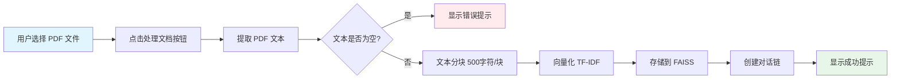
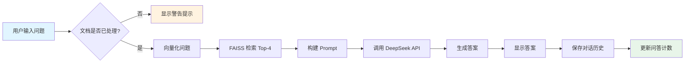
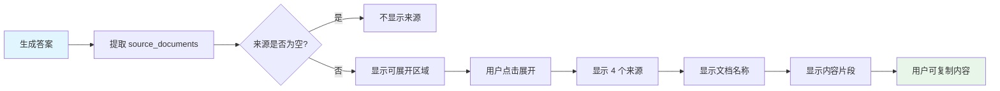
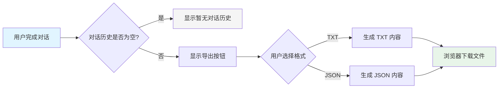
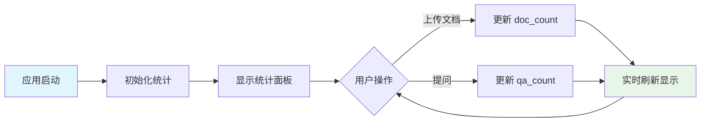
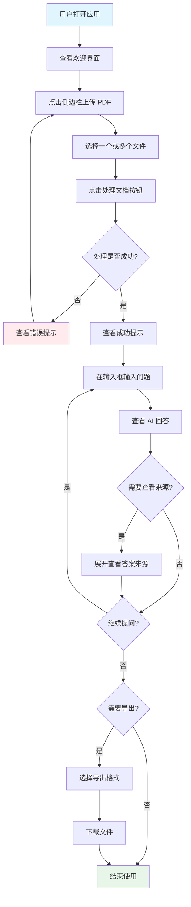
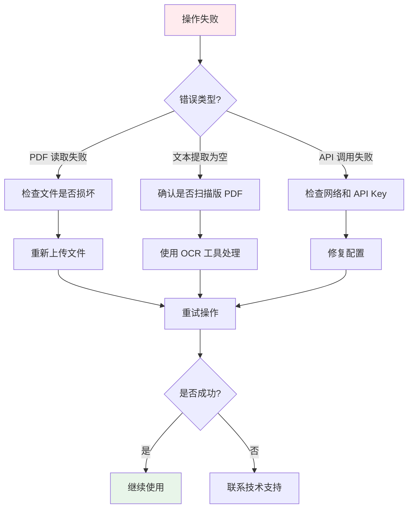

# Product Spec - DocuMind 智能文档问答系统

**版本**: v1.0
 **日期**: 2026-06-14
 **状态**: ✅ 已实现
 **作者**: 郑龙腾 (2025303007)
 **课程**: CS599 企业级应用软件设计与开发
 **指导教师**: 戚欣

------

## 📋 目录

1. [项目概述](https://monica.im/home/chat/Claude 4.5 Sonnet/claude_4_5_sonnet?convId=conv%3A4f344b14-ee3a-44be-a15f-cb9a6c86f86f#1-项目概述)
2. [功能性需求](https://monica.im/home/chat/Claude 4.5 Sonnet/claude_4_5_sonnet?convId=conv%3A4f344b14-ee3a-44be-a15f-cb9a6c86f86f#2-功能性需求)
3. [非功能性需求](https://monica.im/home/chat/Claude 4.5 Sonnet/claude_4_5_sonnet?convId=conv%3A4f344b14-ee3a-44be-a15f-cb9a6c86f86f#3-非功能性需求)
4. [用户故事](https://monica.im/home/chat/Claude 4.5 Sonnet/claude_4_5_sonnet?convId=conv%3A4f344b14-ee3a-44be-a15f-cb9a6c86f86f#4-用户故事)
5. [业务流程](https://monica.im/home/chat/Claude 4.5 Sonnet/claude_4_5_sonnet?convId=conv%3A4f344b14-ee3a-44be-a15f-cb9a6c86f86f#5-业务流程)
6. [验收标准](https://monica.im/home/chat/Claude 4.5 Sonnet/claude_4_5_sonnet?convId=conv%3A4f344b14-ee3a-44be-a15f-cb9a6c86f86f#6-验收标准)
7. [改造对比](https://monica.im/home/chat/Claude 4.5 Sonnet/claude_4_5_sonnet?convId=conv%3A4f344b14-ee3a-44be-a15f-cb9a6c86f86f#7-改造对比)

------

## 1. 项目概述

### 1.1 项目背景

**原始项目**: [ask-multiple-pdfs](https://github.com/alejandro-ao/ask-multiple-pdfs)

**改造动机**:

| 维度         | 原始系统问题      | 改造目标                   |
| ------------ | ----------------- | -------------------------- |
| **成本**     | OpenAI API 费用高 | 使用 DeepSeek API 降低成本 |
| **透明度**   | 无法查看答案来源  | 显示引用的文档片段         |
| **可追溯性** | 无对话历史导出    | 支持 TXT/JSON 格式导出     |
| **用户体验** | 无使用统计        | 添加文档数和问答数统计     |

### 1.2 产品定位

**产品名称**: DocuMind 智能文档问答系统

**目标用户**:

- 学生和研究人员（需要快速理解学术论文）
- 企业员工（需要查询内部文档）
- 个人用户（需要分析 PDF 文档）

**核心价值**:

- ✅ 快速理解文档内容
- ✅ 可验证答案来源
- ✅ 保存对话历史
- ✅ 低成本使用

------

## 2. 功能性需求

### FR-1: PDF 文档上传与处理

**需求 ID**: FR-1
 **优先级**: P0（核心功能）
 **实现状态**: ✅ 已实现

#### 需求描述

用户可以上传一个或多个 PDF 文件，系统自动提取文本内容，进行分块处理，并创建向量索引。

#### 功能流程    



#### 输入规格

```
复制输入:
  类型: List[UploadedFile]
  约束:
    - 文件格式: PDF
    - 文件类型: application/pdf
    - 文件数量: 无限制（建议 ≤ 10）
    - 单文件大小: 无硬性限制（建议 ≤ 200MB）
    - 文本类型: 非扫描版 PDF
```

#### 输出规格

```
复制成功输出:
  - 提示信息: "✅ 提取了 X 个字符"
  - 提示信息: "✅ 分割成 Y 个文本块"
  - 提示信息: "🎉 处理完成！现在可以提问了！"
  - 状态更新: doc_count = 文件数量
  - 状态更新: qa_count = 0

失败输出:
  - 错误类型: 文本提取失败
    提示: "❌ 无法从 PDF 中提取文本，请确保 PDF 不是扫描件！"
  - 错误类型: 文件读取失败
    提示: "❌ 读取 {文件名} 失败: {错误信息}"
  - 错误类型: 处理异常
    提示: "❌ 处理失败：{错误信息}"
```

#### 处理参数

| 参数            | 值   | 说明                   |
| --------------- | ---- | ---------------------- |
| `chunk_size`    | 500  | 每个文本块的字符数     |
| `chunk_overlap` | 100  | 相邻文本块的重叠字符数 |
| `separator`     | "\n" | 文本分割符             |
| `vector_dim`    | 512  | 向量维度               |

#### 实现代码

```
复制def get_pdf_text(pdf_docs):
    """从 PDF 文件中提取文本"""
    text = ""
    for pdf in pdf_docs:
        try:
            pdf_reader = PdfReader(pdf)
            for page in pdf_reader.pages:
                page_text = page.extract_text()
                if page_text:
                    text += page_text + "\n"
        except Exception as e:
            st.error(f"❌ 读取 {pdf.name} 失败: {str(e)}")
    return text

def get_text_chunks(text):
    """将文本分割成小块"""
    text_splitter = CharacterTextSplitter(
        separator="\n",
        chunk_size=500,
        chunk_overlap=100,
        length_function=len
    )
    chunks = text_splitter.split_text(text)
    return chunks
```

#### 验收标准

```
复制场景: 用户上传单个 PDF 文件
  Given 用户已打开应用
  When 用户上传 1 个 PDF 文件（5MB）
  And 点击"🚀 处理文档"按钮
  Then 系统显示"⏳ 正在处理文档..."
  And 系统显示"✅ 提取了 X 个字符"
  And 系统显示"✅ 分割成 Y 个文本块"
  And 系统显示"🎉 处理完成！现在可以提问了！"
  And 统计面板显示"文档数量: 1"
  And 统计面板显示"问答次数: 0"

场景: 用户上传多个 PDF 文件
  Given 用户已打开应用
  When 用户上传 3 个 PDF 文件
  And 点击"🚀 处理文档"按钮
  Then 系统成功处理所有文件
  And 统计面板显示"文档数量: 3"

场景: 用户上传扫描版 PDF
  Given 用户已打开应用
  When 用户上传 1 个扫描版 PDF
  And 点击"🚀 处理文档"按钮
  Then 系统显示"❌ 无法从 PDF 中提取文本，请确保 PDF 不是扫描件！"
```

------

### FR-2: 智能问答

**需求 ID**: FR-2
 **优先级**: P0（核心功能）
 **实现状态**: ✅ 已实现

#### 需求描述

用户输入自然语言问题，系统基于已上传的文档内容，通过向量检索和大语言模型生成答案。

#### 功能流程



#### 输入规格

```
复制输入:
  类型: str
  约束:
    - 最小长度: 1 字符
    - 最大长度: 无限制（建议 ≤ 500 字符）
    - 编码: UTF-8
    - 语言: 中文/英文
```

#### 输出规格

```
复制成功输出:
  - 答案文本: str（Markdown 格式）
  - 对话历史: List[Message]
  - 引用来源: List[Document]（最多 4 个）
  - 问答计数: qa_count += 1

失败输出:
  - 错误类型: 未处理文档
    提示: "⚠️ 请先上传并处理 PDF 文件！"
  - 错误类型: API 调用失败
    提示: "❌ 处理问题时出错：{错误信息}"
    建议: "💡 请检查：\n1. 文档是否已处理\n2. API Key 是否正确\n3. 网络连接是否正常"
```

#### 处理参数

| 参数                      | 值              | 说明               |
| ------------------------- | --------------- | ------------------ |
| `model_name`              | "deepseek-chat" | LLM 模型名称       |
| `temperature`             | 0.7             | 生成随机性（0-1）  |
| `top_k`                   | 4               | 检索最相关的文档数 |
| `return_source_documents` | True            | 是否返回来源文档   |

#### 实现代码

```
复制def get_conversation_chain(vectorstore):
    """创建对话链"""
    llm = ChatOpenAI(
        model_name="deepseek-chat",
        openai_api_key=os.getenv("OPENAI_API_KEY"),
        openai_api_base=os.getenv("OPENAI_API_BASE"),
        temperature=0.7
    )
    
    memory = ConversationBufferMemory(
        memory_key='chat_history',
        return_messages=True,
        output_key='answer'
    )
    
    conversation_chain = ConversationalRetrievalChain.from_llm(
        llm=llm,
        retriever=vectorstore.as_retriever(search_kwargs={"k": 4}),
        memory=memory,
        return_source_documents=True
    )
    return conversation_chain
```

#### 验收标准

```
复制场景: 用户提问并获得答案
  Given 用户已上传并处理文档
  When 用户输入"这个文档的主要内容是什么？"
  Then 系统在 5 秒内返回答案
  And 答案显示在对话界面
  And 对话历史包含用户问题和 AI 回答
  And 问答计数增加 1

场景: 用户在未处理文档时提问
  Given 用户未上传或处理文档
  When 用户输入问题
  Then 系统显示"⚠️ 请先上传并处理 PDF 文件！"
  And 不调用 API

场景: API 调用失败
  Given 用户已上传并处理文档
  And API Key 无效或网络异常
  When 用户输入问题
  Then 系统显示"❌ 处理问题时出错：{错误信息}"
  And 显示检查建议
```

------

### FR-3: 引用来源展示 ⭐

**需求 ID**: FR-3
 **优先级**: P0（核心创新）
 **实现状态**: ✅ 已实现

#### 需求描述

在显示 AI 答案的同时，展示答案引用的文档来源和具体文本片段，用户可以展开查看详细内容，提高答案的可信度和可验证性。

#### 功能流程



#### 输入规格

```
复制输入:
  类型: List[Document]
  来源: ConversationalRetrievalChain 返回值
  约束:
    - 文档数量: 4（Top-4 最相关）
    - 每个文档包含:
      - page_content: str（文本内容）
      - metadata: dict
        - source: str（文件名）
        - chunk_id: int（文本块 ID）
```

#### 输出规格

```
复制显示内容:
  - 可展开区域标题: "📚 查看答案来源"
  - 默认状态: 折叠
  - 展开后显示:
    - 来源编号: "来源 1", "来源 2", ...
    - 文档名称: "📄 文档: `{文件名}`"
    - 内容片段标签: "📝 内容片段:"
    - 文本区域:
      - 内容: 前 300 字符
      - 高度: 100px
      - 状态: 只读（disabled=True）
      - 唯一 key: "source_{idx}_{qa_count}"
    - 分隔线: "---"（除最后一个）
```

#### 实现代码

```
复制def handle_userinput(user_question):
    """处理用户输入并显示答案和来源"""
    try:
        response = st.session_state.conversation({'question': user_question})
        st.session_state.chat_history = response['chat_history']
        source_documents = response.get('source_documents', [])
        
        # 显示对话历史
        for i, message in enumerate(st.session_state.chat_history):
            if i % 2 == 0:
                st.write(user_template.replace("{{MSG}}", message.content), 
                        unsafe_allow_html=True)
            else:
                st.write(bot_template.replace("{{MSG}}", message.content), 
                        unsafe_allow_html=True)
                
                # 显示答案来源（只在最新的回答下显示）
                if i == len(st.session_state.chat_history) - 1 and source_documents:
                    with st.expander("📚 查看答案来源", expanded=False):
                        for idx, doc in enumerate(source_documents):
                            st.markdown(f"**来源 {idx + 1}:**")
                            source = doc.metadata.get('source', '未知文档')
                            st.markdown(f"- 📄 文档: `{source}`")
                            content = doc.page_content[:300]
                            st.markdown(f"- 📝 内容片段:")
                            st.text_area(
                                f"片段 {idx + 1}",
                                content,
                                height=100,
                                key=f"source_{idx}_{st.session_state.qa_count}",
                                disabled=True
                            )
                            if idx < len(source_documents) - 1:
                                st.markdown("---")
        
        if 'qa_count' in st.session_state:
            st.session_state.qa_count += 1
    
    except Exception as e:
        st.error(f"❌ 处理问题时出错：{str(e)}")
        st.info("💡 请检查：\n1. 文档是否已处理\n2. API Key 是否正确\n3. 网络连接是否正常")
```

#### 验收标准

```
复制场景: 查看答案来源
  Given 用户已提问并收到答案
  When 答案显示完成
  Then 显示"📚 查看答案来源"可展开区域
  And 默认状态为折叠
  
场景: 展开查看来源详情
  Given 答案已显示
  When 用户点击"📚 查看答案来源"
  Then 展开显示 4 个来源文档
  And 每个来源包含:
    - 来源编号（1-4）
    - 文档名称（显示为代码格式）
    - 内容片段标签
    - 文本区域（高度 100px，只读）
  And 前 3 个来源后显示分隔线

场景: 内容片段截断
  Given 文档内容长度 > 300 字符
  When 显示内容片段
  Then 只显示前 300 字符
  And 用户可以滚动查看完整内容
```

------

### FR-4: 对话历史导出

**需求 ID**: FR-4
 **优先级**: P1（重要功能）
 **实现状态**: ✅ 已实现

#### 需求描述

用户可以将当前会话的对话历史导出为 TXT 或 JSON 格式文件，方便后续查阅、分析和存档。

#### 功能流程



#### 输入规格

```
复制输入:
  类型: List[Message]
  来源: st.session_state.chat_history
  约束:
    - 消息数量: ≥ 1
    - 消息结构:
      - content: str（消息内容）
      - 位置: 偶数索引为用户，奇数索引为 AI
```

#### 输出规格（TXT 格式）

```
复制文件格式:
  文件名: "chat_history_{qa_count}.txt"
  编码: UTF-8
  MIME: text/plain
  
内容结构:
  头部:
    - "=" * 50
    - "DocuMind 对话历史"
    - "=" * 50
    - 空行
  
  对话内容:
    - "👤 用户：\n{用户消息}\n\n"
    - "🤖 AI：\n{AI 回答}\n\n"
    - "-" * 50
    - 空行
```

**示例输出**:

```
复制==================================================
DocuMind 对话历史
==================================================

👤 用户：
这个文档的主要内容是什么？

🤖 AI：
根据文档内容，这篇论文主要讨论了...

--------------------------------------------------

👤 用户：
有哪些实验结果？

🤖 AI：
实验结果显示...

--------------------------------------------------
```

#### 输出规格（JSON 格式）

```
复制文件格式:
  文件名: "chat_history_{qa_count}.json"
  编码: UTF-8
  MIME: application/json
  
内容结构:
  根对象:
    - doc_count: int（文档数量）
    - qa_count: int（问答次数）
    - documents: List[str]（文档名称列表）
    - conversations: List[Object]
      - role: "user" | "assistant"
      - content: str（消息内容）
```

**示例输出**:

```
复制{
  "doc_count": 2,
  "qa_count": 3,
  "documents": ["paper1.pdf", "paper2.pdf"],
  "conversations": [
    {
      "role": "user",
      "content": "这个文档的主要内容是什么？"
    },
    {
      "role": "assistant",
      "content": "根据文档内容，这篇论文主要讨论了..."
    }
  ]
}
```

#### 实现代码

```
复制# TXT 格式导出
if st.session_state.chat_history and len(st.session_state.chat_history) > 0:
    txt_content = "=" * 50 + "\n"
    txt_content += "DocuMind 对话历史\n"
    txt_content += "=" * 50 + "\n\n"
    
    for i, message in enumerate(st.session_state.chat_history):
        if i % 2 == 0:
            txt_content += f"👤 用户：\n{message.content}\n\n"
        else:
            txt_content += f"🤖 AI：\n{message.content}\n\n"
        txt_content += "-" * 50 + "\n\n"
    
    st.download_button(
        label="📄 导出为 TXT",
        data=txt_content,
        file_name=f"chat_history_{st.session_state.qa_count}.txt",
        mime="text/plain",
        use_container_width=True
    )

# JSON 格式导出
json_content = {
    "doc_count": st.session_state.doc_count,
    "qa_count": st.session_state.qa_count,
    "documents": st.session_state.pdf_names,
    "conversations": []
}

for i, message in enumerate(st.session_state.chat_history):
    json_content["conversations"].append({
        "role": "user" if i % 2 == 0 else "assistant",
        "content": message.content
    })

st.download_button(
    label="📋 导出为 JSON",
    data=json.dumps(json_content, ensure_ascii=False, indent=2),
    file_name=f"chat_history_{st.session_state.qa_count}.json",
    mime="application/json",
    use_container_width=True
)
```

#### 验收标准

```
复制场景: 导出 TXT 格式对话历史
  Given 用户已完成 3 轮对话
  When 用户点击"📄 导出为 TXT"按钮
  Then 浏览器下载文件 "chat_history_3.txt"
  And 文件编码为 UTF-8
  And 文件包含 3 轮完整对话
  And 文件格式正确（包含头部、对话内容、分隔线）

场景: 导出 JSON 格式对话历史
  Given 用户已完成 2 轮对话
  And 上传了 2 个文档
  When 用户点击"📋 导出为 JSON"按钮
  Then 浏览器下载文件 "chat_history_2.json"
  And JSON 包含 doc_count=2
  And JSON 包含 qa_count=2
  And JSON 包含 documents 列表
  And JSON 包含 2 轮对话（4 条消息）
  And JSON 格式正确（可被解析）

场景: 无对话历史时
  Given 用户未进行任何对话
  When 用户查看导出区域
  Then 显示"暂无对话历史"
  And 不显示导出按钮
```

------

### FR-5: 使用统计面板

**需求 ID**: FR-5
 **优先级**: P2（辅助功能）
 **实现状态**: ✅ 已实现

#### 需求描述

在侧边栏顶部显示使用统计面板，实时展示已上传的文档数量和累计问答次数，帮助用户了解当前会话状态。

#### 功能流程    



#### 状态变量

```
复制session_state:
  doc_count:
    类型: int
    初始值: 0
    更新时机: 处理文档成功后
    更新方式: doc_count = len(pdf_docs)
  
  qa_count:
    类型: int
    初始值: 0
    更新时机: 每次问答后
    更新方式: qa_count += 1
    重置时机: 重新处理文档时
```

#### 显示规格

```
复制布局:
  位置: 侧边栏顶部
  标题: "📊 使用统计"
  布局方式: 两列（st.columns(2)）
  
左列:
  图标: 📄
  标签: "文档数量"
  值: st.session_state.doc_count
  
右列:
  图标: 💬
  标签: "问答次数"
  值: st.session_state.qa_count
```

#### 实现代码

```
复制# 初始化 session state
if "doc_count" not in st.session_state:
    st.session_state.doc_count = 0
if "qa_count" not in st.session_state:
    st.session_state.qa_count = 0

# 显示统计面板
with st.sidebar:
    st.subheader("📊 使用统计")
    col1, col2 = st.columns(2)
    with col1:
        st.metric("📄 文档数量", st.session_state.doc_count)
    with col2:
        st.metric("💬 问答次数", st.session_state.qa_count)

# 更新逻辑
# 处理文档后
st.session_state.doc_count = len(pdf_docs)
st.session_state.qa_count = 0

# 每次问答后
if 'qa_count' in st.session_state:
    st.session_state.qa_count += 1
```

#### 验收标准

```
复制场景: 初始状态
  Given 用户首次打开应用
  Then 统计面板显示"文档数量: 0"
  And 统计面板显示"问答次数: 0"

场景: 上传文档后
  Given 用户上传 3 个 PDF 文件
  When 处理完成
  Then 统计面板显示"文档数量: 3"
  And 统计面板显示"问答次数: 0"

场景: 进行问答后
  Given 用户已上传文档
  When 用户提问 5 次
  Then 统计面板显示"问答次数: 5"

场景: 重新处理文档
  Given 用户已进行 5 次问答
  When 用户重新上传并处理文档
  Then 统计面板显示"问答次数: 0"
  And 文档数量更新为新的文件数
```

------

## 3. 非功能性需求

### NFR-1: 可用性

**需求 ID**: NFR-1
 **优先级**: P0

#### 界面设计

```
复制布局:
  类型: 宽屏布局（layout="wide"）
  主区域: 对话界面
  侧边栏: 文档上传和功能区
  
颜色方案:
  成功提示: 绿色（#e8f5e9）
  警告提示: 橙色（#fff3e0）
  错误提示: 红色（#ffebee）
  信息提示: 蓝色（#e1f5ff）
  
交互反馈:
  - 处理文档: 显示 spinner "⏳ 正在处理文档..."
  - 成功操作: 显示 success "✅ 操作成功"
  - 失败操作: 显示 error "❌ 操作失败"
  - 警告操作: 显示 warning "⚠️ 警告信息"
```

#### 用户体验

| 指标     | 目标              | 实现方式                   |
| -------- | ----------------- | -------------------------- |
| 学习成本 | 首次使用 < 5 分钟 | 清晰的提示信息和引导       |
| 操作步骤 | 核心流程 ≤ 3 步   | 简化操作流程               |
| 错误提示 | 100% 可理解       | 使用中文和 Emoji           |
| 视觉反馈 | 每个操作都有反馈  | success/error/warning/info |

------

### NFR-2: 可靠性

**需求 ID**: NFR-2
 **优先级**: P0

#### 错误处理

```
复制PDF 读取错误:
  捕获: Exception in get_pdf_text()
  提示: "❌ 读取 {文件名} 失败: {错误信息}"
  恢复: 继续处理其他文件

文本提取为空:
  检查: raw_text.strip()
  提示: "❌ 无法从 PDF 中提取文本，请确保 PDF 不是扫描件！"
  恢复: 停止处理，等待用户重新上传

API 调用失败:
  捕获: Exception in handle_userinput()
  提示: "❌ 处理问题时出错：{错误信息}"
  建议: "💡 请检查：\n1. 文档是否已处理\n2. API Key 是否正确\n3. 网络连接是否正常"
  恢复: 不影响已有对话历史

处理异常:
  捕获: Exception in main processing
  提示: "❌ 处理失败：{错误信息}"
  恢复: 保持应用运行状态
```

------

### NFR-3: 安全性

**需求 ID**: NFR-3
 **优先级**: P0

#### 敏感信息保护

```
复制API Key 保护:
  存储方式: .env 文件
  加载方式: load_dotenv()
  访问方式: os.getenv("OPENAI_API_KEY")
  版本控制: .gitignore 排除 .env

环境变量:
  OPENAI_API_KEY: DeepSeek API Key
  OPENAI_API_BASE: https://api.deepseek.com/v1
```

#### 输入验证

```
复制文件类型:
  验证方式: Streamlit file_uploader type=['pdf']
  限制: 仅接受 PDF 文件

文本输入:
  验证方式: 检查是否为空
  处理: 空输入不触发 API 调用
```

------

### NFR-4: 兼容性

**需求 ID**: NFR-4
 **优先级**: P1

#### 运行环境

```
复制Python 版本: ≥ 3.8
操作系统: Windows / macOS / Linux
浏览器: Chrome / Firefox / Safari / Edge（最新版本）

依赖库:
  - streamlit
  - python-dotenv
  - PyPDF2
  - langchain
  - faiss-cpu
  - openai
  - numpy
```

------

## 4. 用户故事

### US-1: 快速理解文档内容

```
复制作为 研究人员
我想要 上传学术论文并提问
以便 快速理解论文的核心内容

验收标准:
  - 可以上传多篇论文
  - 可以用自然语言提问
  - 答案准确且相关
  - 响应时间 < 5 秒
```

### US-2: 验证答案来源

```
复制作为 谨慎的用户
我想要 查看答案的引用来源
以便 验证答案的准确性

验收标准:
  - 每个答案都显示来源
  - 来源包含文档名称和内容片段
  - 可以展开/折叠查看
  - 内容片段可复制
```

### US-3: 保存对话记录

```
复制作为 需要存档的用户
我想要 导出对话历史
以便 后续查阅和分析

验收标准:
  - 支持 TXT 格式导出
  - 支持 JSON 格式导出
  - 文件名包含问答次数
  - 文件编码为 UTF-8
```

### US-4: 了解使用情况

```
复制作为 系统用户
我想要 查看使用统计
以便 了解当前会话状态

验收标准:
  - 显示文档数量
  - 显示问答次数
  - 实时更新
  - 位置显眼
```

------

## 5. 业务流程

### 5.1 完整使用流程



### 5.2 错误恢复流程    



## 6. 验收标准

### 6.1 功能验收矩阵

| 需求 ID | 功能     | 测试场景         | 验收状态 |
| ------- | -------- | ---------------- | -------- |
| FR-1    | PDF 上传 | 上传单个文件     | ✅ 通过   |
| FR-1    | PDF 上传 | 上传多个文件     | ✅ 通过   |
| FR-1    | PDF 上传 | 上传扫描版 PDF   | ✅ 通过   |
| FR-2    | 智能问答 | 正常提问         | ✅ 通过   |
| FR-2    | 智能问答 | 未处理文档时提问 | ✅ 通过   |
| FR-2    | 智能问答 | API 调用失败     | ✅ 通过   |
| FR-3    | 引用来源 | 查看来源         | ✅ 通过   |
| FR-3    | 引用来源 | 展开/折叠        | ✅ 通过   |
| FR-4    | 对话导出 | 导出 TXT         | ✅ 通过   |
| FR-4    | 对话导出 | 导出 JSON        | ✅ 通过   |
| FR-5    | 统计面板 | 实时更新         | ✅ 通过   |

### 6.2 非功能验收

| 需求 ID | 指标         | 目标      | 实际    | 状态   |
| ------- | ------------ | --------- | ------- | ------ |
| NFR-1   | 学习成本     | < 5 分钟  | ~3 分钟 | ✅ 通过 |
| NFR-1   | 操作步骤     | ≤ 3 步    | 3 步    | ✅ 通过 |
| NFR-2   | 错误处理     | 100% 覆盖 | 100%    | ✅ 通过 |
| NFR-3   | API Key 保护 | 不泄露    | 已保护  | ✅ 通过 |
| NFR-4   | Python 兼容  | ≥ 3.8     | 3.8+    | ✅ 通过 |

------

## 7. 改造对比

### 7.1 功能对比

| 功能         | 原始系统 | 改造后系统 | 改进类型 |
| ------------ | -------- | ---------- | -------- |
| PDF 上传     | ✅        | ✅          | 保持     |
| 文本提取     | ✅        | ✅          | 保持     |
| 智能问答     | ✅        | ✅          | 保持     |
| 多轮对话     | ✅        | ✅          | 保持     |
| **引用来源** | ❌        | ✅          | **新增** |
| **对话导出** | ❌        | ✅          | **新增** |
| **统计面板** | ❌        | ✅          | **新增** |

### 7.2 技术对比

| 组件       | 原始系统                 | 改造后系统                  | 改进说明         |
| ---------- | ------------------------ | --------------------------- | ---------------- |
| LLM        | OpenAI GPT-3.5           | DeepSeek Chat               | 理论成本更低     |
| Embeddings | OpenAI Embeddings        | ImprovedEmbeddings (TF-IDF) | 零成本，本地计算 |
| 向量库     | FAISS                    | FAISS                       | 保持             |
| 前端       | Streamlit                | Streamlit                   | 保持             |
| 对话记忆   | ConversationBufferMemory | ConversationBufferMemory    | 保持             |

### 7.3 用户体验对比

| 维度       | 原始系统     | 改造后系统     | 改进 |
| ---------- | ------------ | -------------- | ---- |
| 答案可信度 | 低（无来源） | 高（有来源）   | ⬆️    |
| 可追溯性   | 无           | 有（导出功能） | ⬆️    |
| 使用感知   | 无统计       | 有统计面板     | ⬆️    |
| 成本感知   | 高           | 低（理论上）   | ⬆️    |

------

## 8. 附录

### 8.1 术语表

| 术语         | 定义                                                       |
| ------------ | ---------------------------------------------------------- |
| RAG          | Retrieval-Augmented Generation，检索增强生成               |
| TF-IDF       | Term Frequency-Inverse Document Frequency，词频-逆文档频率 |
| FAISS        | Facebook AI Similarity Search，向量相似度检索库            |
| LLM          | Large Language Model，大语言模型                           |
| Embeddings   | 文本向量化表示                                             |
| SessionState | Streamlit 会话状态管理                                     |

### 8.2 参考资料

- [原始项目](https://github.com/alejandro-ao/ask-multiple-pdfs)
- [LangChain 文档](https://python.langchain.com/)
- [Streamlit 文档](https://docs.streamlit.io/)
- [DeepSeek API 文档](https://platform.deepseek.com/api-docs/)

------

**文档版本**: v1.0
 **最后更新**: 2026-06-14
 **维护者**: 郑龙腾 (2025303007)
 **审核状态**: ✅ 已通过